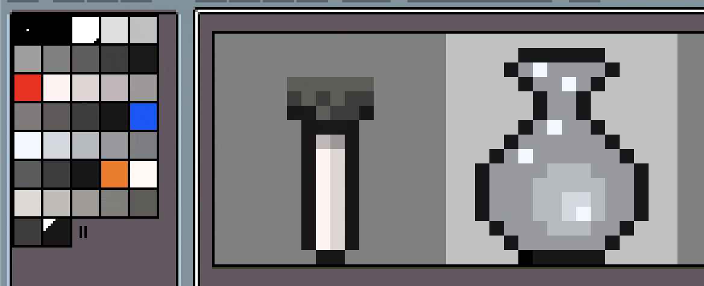
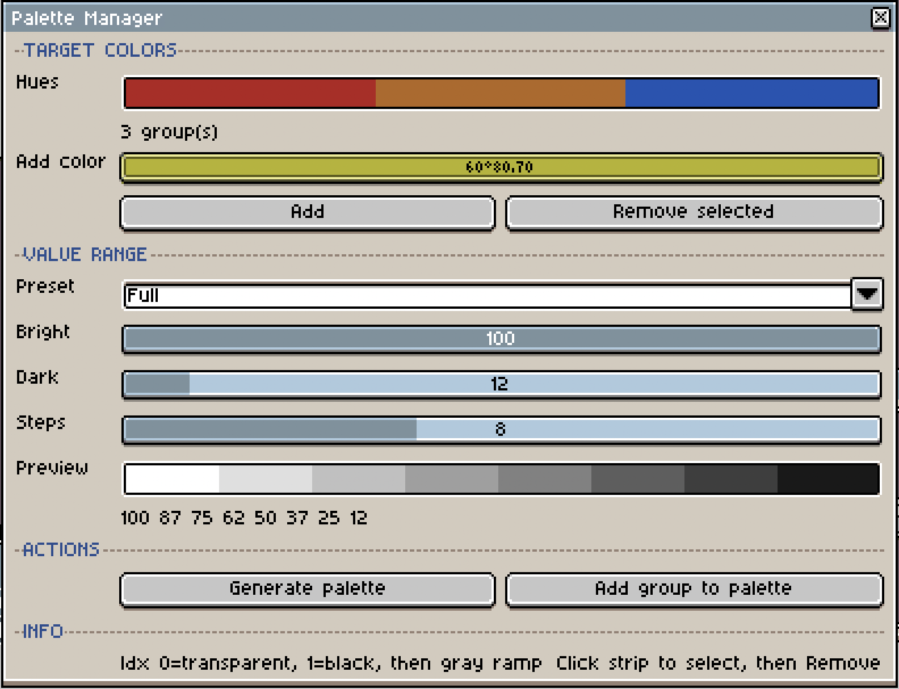

# Palette Manager for Aseprite

A set of Lua scripts for Aseprite that support a **value-first pixel art workflow** — draw in near-gray first, then colorize instantly.





## The idea

A strong pixel art piece reads well in grayscale. If your values (light/dark) work without color, they'll work even better with color. This toolset automates the tedious parts of that workflow:

1. **Pick your target hues** (skin, armor, cloth, etc.)
2. **Generate a palette** with near-gray ramps — one per hue, organized with vivid markers
3. **Paint your sprite** focusing only on form, light, and shadow
4. **Hit a hotkey** to toggle between grayscale and full color instantly

Works best in **Indexed Color Mode** (`Sprite > Color Mode > Indexed`), where palette edits update every pixel on the canvas immediately.

## Scripts

| Script | Purpose |
|---|---|
| `PaletteManager.lua` | Main dialog — generate palettes, import hues, add groups |
| `PM_Toolbar.lua` | Compact floating panel with saturation slider |
| `PM_Toggle.lua` | **One-hotkey toggle** between gray and color (no UI) |

### PaletteManager.lua

The full setup dialog. Use this at the start of a piece to build your palette.

- **Color strip** — shows target hues as a visual strip. Click a color to select it
- **Auto-import** — on open, detects markers (S=100%) for precise hue import; falls back to S≥15% for user palettes without markers
- **Add / Remove** — add colors from the picker, remove selected colors from the strip
- **Generate palette** — creates organized ramps with configurable value steps
- **Value range presets** — Full, Dark, Pastel, or Custom; adjustable via bright/dark/steps sliders
- **Add group** — appends a new color group to an existing palette without affecting what's already there

#### Generated palette structure

With the default Full preset (8 steps, bright=100, dark=12):

```
Index 0      — transparent (mask color)
Index 1      — black (outlines)
Index 2-9    — gray ramp (V=100..12, S=0%)
Index 10     — ■ Marker (vivid, H=30, S=100%) ← visual guide, don't paint with this
Index 11-18  — Ramp (H=30, S=5%, V=100..12) ← paint with these
Index 19     — ■ Marker (vivid, H=210, S=100%)
Index 20-27  — Ramp (H=210, S=5%, V=100..12)
...
```

The gray ramp size and group size depend on the number of value steps.

### PM_Toolbar.lua

A small floating panel you can keep open while painting. Has a saturation slider and two buttons (Colorize / Desaturate). Drag it to a corner so it doesn't block your canvas.

### PM_Toggle.lua

No UI at all — bind it to a hotkey and press to toggle. The script detects the current state by checking ramp saturation (skipping markers with S = 100%):

- If any ramp color has S < 20% → palette is gray → colorizes to S=70%
- If all ramp colors have S ≥ 20% → palette is colored → desaturates to S=5%

## Install

1. In Aseprite, go to `File > Scripts > Open Scripts Folder`
2. Copy all `.lua` files into that folder
3. Go to `File > Scripts > Rescan Scripts Folder`
4. (Optional) Bind hotkeys in `Edit > Keyboard Shortcuts` — search for the script names

## Settings

Each script has configuration variables at the top that you can edit:

```lua
COLORIZE_SATURATION = 70  -- S% when colorizing (default: 70)
WORK_SATURATION = 5       -- S% when in gray mode (default: 5)
THRESHOLD = 20             -- S% boundary for toggle detection
```

Value steps are configured in the PaletteManager dialog via presets and sliders:

| Preset | Bright | Dark | Steps |
|--------|--------|------|-------|
| Full   | 100    | 12   | 8     |
| Dark   | 55     | 8    | 6     |
| Pastel | 95     | 50   | 6     |
| Custom | (any)  | (any)| (any) |

## Tips

- **Don't paint with markers.** They're visual guides to help you tell groups apart in the palette. Use the gray ramp colors.
- **Index 0 is always transparent** in Indexed mode — don't use it for drawing. Index 1 = black, then the gray ramp follows.
- **To check your values**, just hit the desaturate hotkey. If everything reads well in gray — you're on track.
- **Hue shifting in shadows/highlights** — after colorizing, you can manually tweak individual ramp colors. Shift shadow hues slightly cooler and highlight hues slightly warmer for more depth.

## License

MIT — do whatever you want with it. See [LICENSE](LICENSE) for details.

_Built with the help of Claude (Anthropic)._
